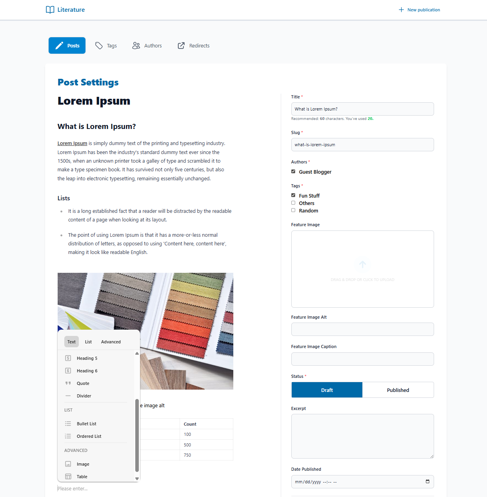

# Literature

`Literature` is a blog content management system with core blog features such as `Publications`, `Posts`, `Authors`, and `Tags`. Content can be published with static html files through a static pages generator that uses `Phoenix.Components`. It comes with a WYSIWYG post editor, image optimization, reusable SEO tags, and seamless integration to an existing Phoenix application.

## Installation

```elixir
def deps do
  [
    {:literature, "~> 0.5"}
  ]
end
```

## Quick Setup

Literature comes with built in database tables that can be added through a migration.

1. Setup config including Ecto repo for Literature to use and directory where static pages will be stored.

```elixir
config :literature,
  repo: MyApp.Repo,
  static_pages_storage_dir: "/tmp/literature/static_pages"
```

2. Setup Literature database tables by creating a new migration. This will create all necessary tables `Publication`, `Post`, `Author`, and `Tag`.

```elixir
defmodule MyApp.Repo.Migrations.SetupLiterature do
  use Ecto.Migration

  def up, do: Literature.Migrations.up([])
  def down, do: Literature.Migrations.down([])
end
```

3. Setup content management dashboard in your router. Use `Literature.Router` and add `literature_assets/1` for styling and JS files and `literature_dashboard/1` for the dashboard LiveView pages.

```elixir
defmodule MyAppWeb.Router do
  ...
  use Literature.Router

  literature_assets("/literature")
  literature_dashboard("/literature")
end
```

4. You can separate content by main topic by creating a publication for each. Create a publication e.g. `Blog` then create authors and tags. You can now start creating Posts with a WYSIWYG editor.

## Images

Literature tables have a few image columns such as feature and profile images. Post content could also have images, both are handled with

- [Waffle](https://github.com/elixir-waffle/waffle) - for uploading to storage buckets
- [Image](https://github.com/elixir-image/image) - for image processing and transforms

Setup literature config for waffle, e.g. for local config

```elixir
config :literature,
  storage: Waffle.Storage.Local,
  storage_dir_prefix: "/tmp/literature/",
  asset_host: "/tmp/literature"
```

## WSYIWYG Post content editor

Post editor supports content formatting and is built with [Milkdown.js](https://milkdown.dev/) markdown editor.
Content is saved both as markdown, and also converted to html for easy rendering with image tags converted to responsive images.
Currently supported features for the editor are `Headings`, `Images`, `Lists`, `Blockquote`, `Tables`, and various formatting such as setting hyperlinks, bold, italic, and underline.



Current rendered styling in the editor is styled with [Tailwind Typography prose](https://github.com/tailwindlabs/tailwindcss-typography). Content styling can be customized on the templates it will be used on and can be rendered through [Phoenix.HTML.raw/1](https://hexdocs.pm/phoenix_html/Phoenix.HTML.html#raw/1)

```elixir
<div class="prose">
  <%= raw(post.html) %>
</div>
```

## Generating Static pages

`Literature.StaticPages.Generator`, `Literature.StaticPages.Layout`, and `Literature.StaticPages.Templates` will be used to generate your static HTML files.

- `Literature.StaticPages.Layout` - Behaviour for static pages layout. Provides a built in `layout/1` component that can be used readily with SEO tags.
- `Literature.StaticPages.Templates` - Behaviour that should contain all templates that will be used for static page generation. Provides placeholder components for all page types. See Available Pages for all available page types.
- `Literature.StaticPages.Generator` - contains all functions that will write your static files, either to a file or in memory.

1. Create your templates module using the built in layout. Here you can fully customize the content of your page and add more assigns using `Phoenix.Components`.

```elixir
defmodule MyAppWeb.Blog.Templates do
  use Phoenix.Component
  @behavior Literature.StaticPages.Templates

  import Literature.StaticPages.Layout, only: [layout: 1]

  @impl true
  def index(assigns) do
    ~H"""
    <.layout {assigns}>
      <h1>{@publication.name}</h1>
      <h2>Posts</h2>
      <ul>
        <li :for={post <- @posts}>
          {post.title}
        </li>
      </ul>
    </.layout>
    """
  end

  def show(assigns) do
    ~H"""
    <.layout {assigns}>
      <h1>{@post.title}</h1>
      <p>
        {raw(@post.html)}
      </p>
    </.layout>
    """
  end
end
```

2. Create your own generator file

```elixir
defmodule MyAppWeb.Blog.Generator do
  alias Literature.StaticPages.Generator, as: LiteratureGenerator

  def generate_index_page do
    opts =
      [
        publication_slug: "blog",
        base_url: "http://localhost:4000",
        templates: MyAppWeb.Blog.Templates,
        write_to: :file
      ]

    LiteratureGenerator.generate(:index, opts)
  end
end
```

Calling `MyAppWeb.Blog.Generator.generate_index_page()` should generate an `index.html` inside your set `static_pages_storage_dir`.
See `Literature.StaticPages.Generator` for more information.

Generated files can be served through `Plug.Static` or through a controller.

```elixir
defmodule MyAppWeb.BlogController do
  use Phoenix.Controller

  def index(conn, _params) do
    static_file_path = "/tmp/literature/static_pages/index.html"

    conn
    |> put_resp_header("content-type", "text/html; charset=utf-8")
    |> Conn.send_file(200, static_file_path)
  end
end
```
